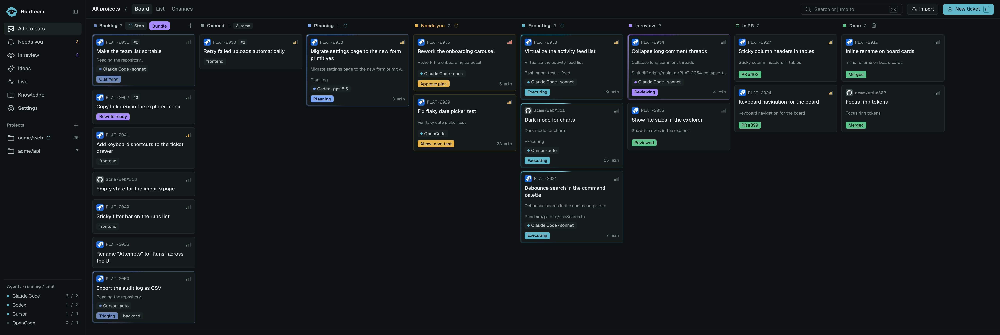
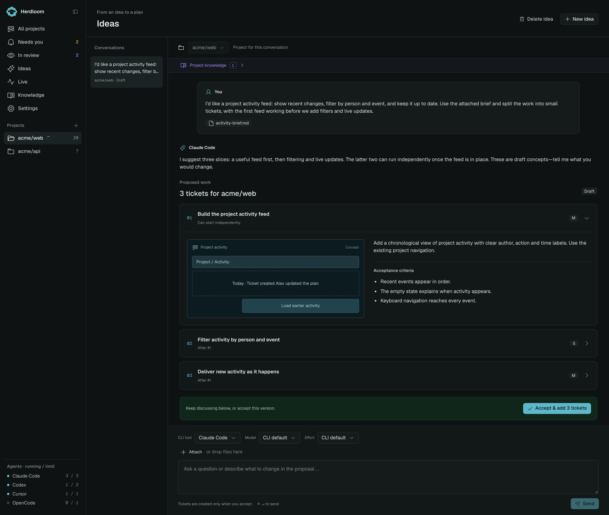
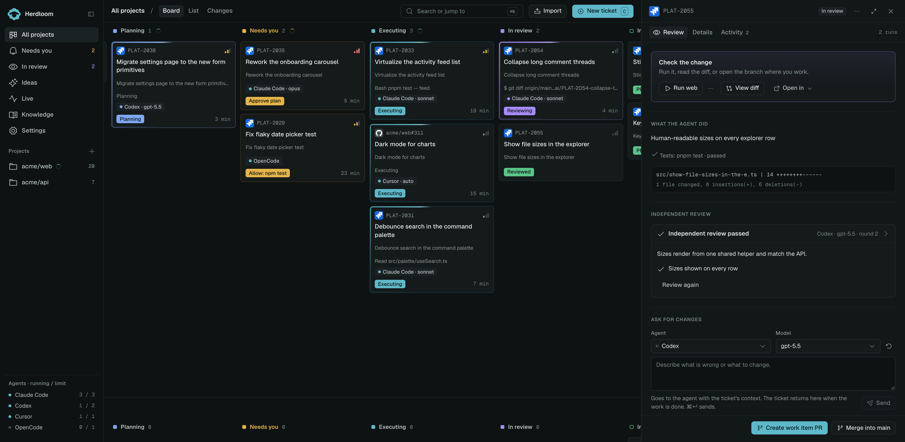
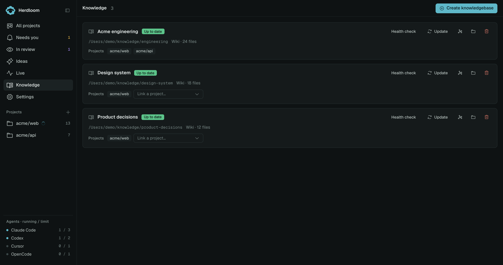
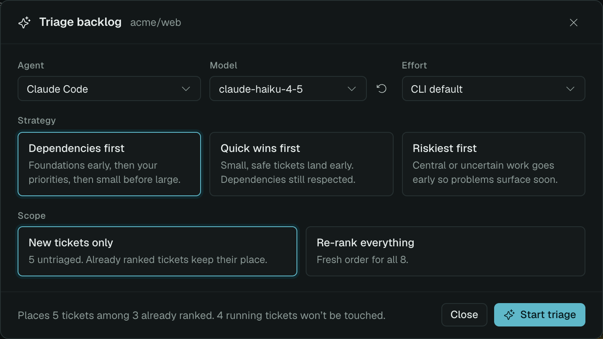
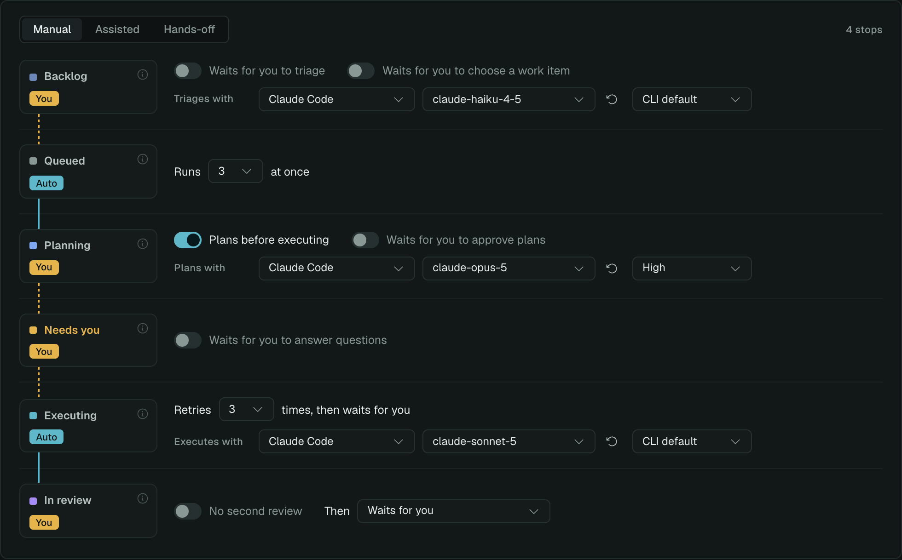
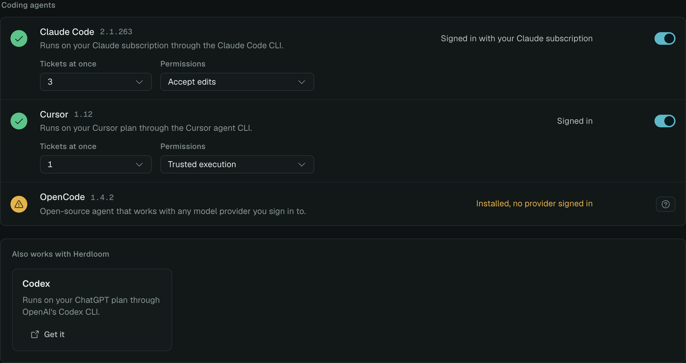
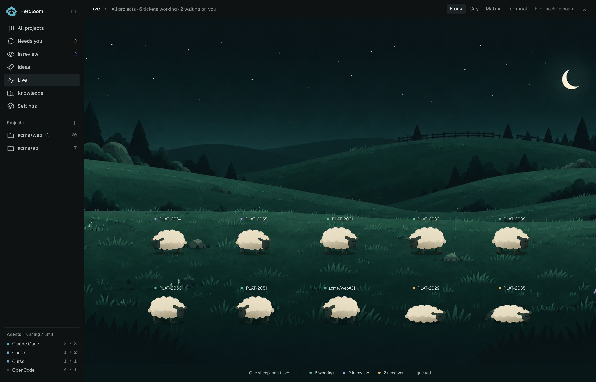

# Herdloom

### [herdloom.com](https://herdloom.com)

**[Join the beta](https://github.com/herdloom/app/discussions/2)**

**A kanban board for coding agents.**

Turn ideas into tickets. Bundle related tickets into a work item, let your agents build them together, and review the result before it ships.

[What Herdloom is](https://herdloom.com/start/what-herdloom-is/) · [Documentation](https://herdloom.com/start/what-herdloom-is/)

**[▶ Watch the overview · 1:39](https://herdloom.com/media/herdloom-overview-v1.mp4)**

---

App screenshots use example projects. Click an image to view it at full resolution.

## Start with an idea, not a backlog

You do not have to know the tickets before you begin. Describe the outcome you want, and the agent reads the repository, asks what it needs to know, and proposes a set of tickets — each with acceptance criteria, a size, a concept sketch, and what it depends on.

Ask for a smaller first version, change the scope, or add what it missed. Nothing reaches the board until you accept.

When you do, the tickets land in the backlog with their dependencies and everything you attached. Bundle the tickets that should ship together into a work item. They run in dependency order, building on the work already in their shared checkout.

Keep talking to the same conversation later and it adds to what you already accepted, rather than starting again.

---

## Plan, execute, review

Choose which enabled agents plan, build, and review. Planning and independent review are configurable, so you can match the workflow to the task.

Each [work item](https://herdloom.com/guides/work-items/) has one checkout, one branch, and one pull request. Its tickets run one at a time; separate work items can run in parallel.

Run the combined app and inspect the changes. You can run a combined acceptance check or approve work you have checked yourself, then create a PR or merge into the target branch. GitHub branch rules still apply. The [Changes page](https://herdloom.com/guides/sync-to-github/) handles local commits, pulling updates, and publishing changes.

---

## It remembers

Point Herdloom at a wiki or a folder of notes. Relevant findings travel from Ideas into planning and execution, so agents can reuse current context instead of repeating the same research. Herdloom refreshes it when needed and teaches the knowledgebase as work lands.

The pages link to each other, so the picture gets better the more you ship. Herdloom checks the wiki against itself and fixes what it can.

Start it from a repository and Herdloom reads the code and writes the first pages itself. Ideas reads it too, so proposals follow the conventions you already have.

---

## It triages and clarifies

Drop rough ideas in. Herdloom ranks and sizes them, spots what blocks what, and rewrites the vague ones into something an agent can actually build.

Label an issue in Jira or GitHub and it lands on the board on its own.

---

## Assisted, or hands-off for the brave

Every column has a switch: wait for you, or run on its own. Start assisted and approve what matters. Let go when the agents have earned it.

---

## Your agents, your subscriptions

Herdloom drives the coding agent CLIs you already have, using your own accounts and your own subscriptions. Run one, or all of them at the same time, on the same board.

Your agents use your existing provider accounts and plans. Herdloom does not resell model access.

---

## See the rest of it

The current documentation and screenshots live at **[herdloom.com](https://herdloom.com)**. Start with [what Herdloom is](https://herdloom.com/start/what-herdloom-is/), then [your first ticket](https://herdloom.com/start/first-ticket/).

---

## Requirements

- macOS on Apple Silicon
- git, and a local checkout of whatever you want worked on
- At least one coding agent CLI, signed in with your own account:
  Claude Code, Codex, Cursor, GitHub Copilot, OpenCode or Antigravity

## Status

Herdloom is in private beta. There is no public download yet.

[Join the beta](https://github.com/herdloom/app/discussions/2) for access instructions.

## Feedback and problems

- Something broken: [open an issue](../../issues/new/choose)
- An idea, a question, or a workflow you want: [start a discussion](../../discussions)

Please include the app version and which agent CLI you were using. Screenshots help.

## Security and privacy

Herdloom runs locally and has no telemetry. Connected coding agents may send prompts and code to their providers through your own accounts. GitHub and Jira connections use the services you enable.

- [Security policy](SECURITY.md) — how to report a vulnerability
- [Privacy](PRIVACY.md) — what the app touches and what leaves your machine

## Licence

Herdloom is proprietary software. See [LICENSE](LICENSE).

This repository is the public home for beta access, issues, discussions, and policies. Documentation lives at [herdloom.com](https://herdloom.com). The application source is not published.

---

## Author

Built by **Julian Oczkowski** — I build AI tools for knowledge work.

- 🎥 **[YouTube · @aiforwork_app](https://www.youtube.com/@aiforwork_app)** — walkthroughs and AI-for-work tutorials
- ✍️ **[Medium](https://medium.com/@julian.oczkowski)** — deep dives on product and AI workflows
- 💼 **[LinkedIn](https://www.linkedin.com/in/julianoczkowski/)** — connect and follow along

© 2026 Julian Oczkowski. Herdloom and the Herdloom mark are trademarks of Julian Oczkowski.

