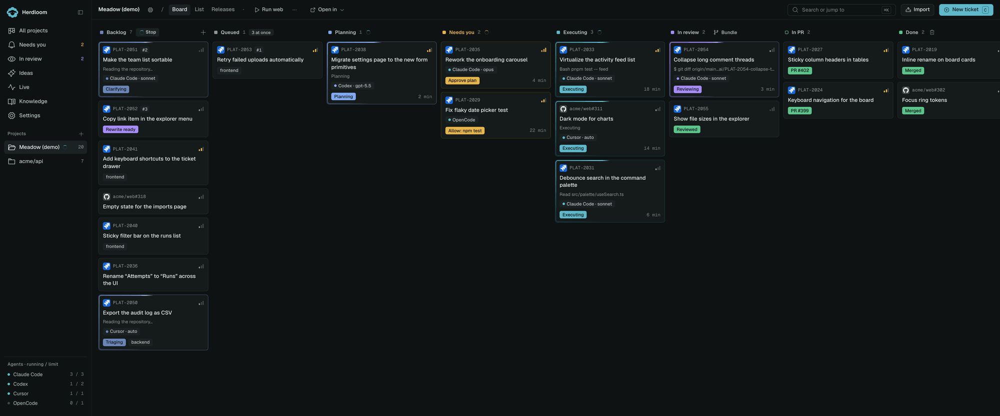
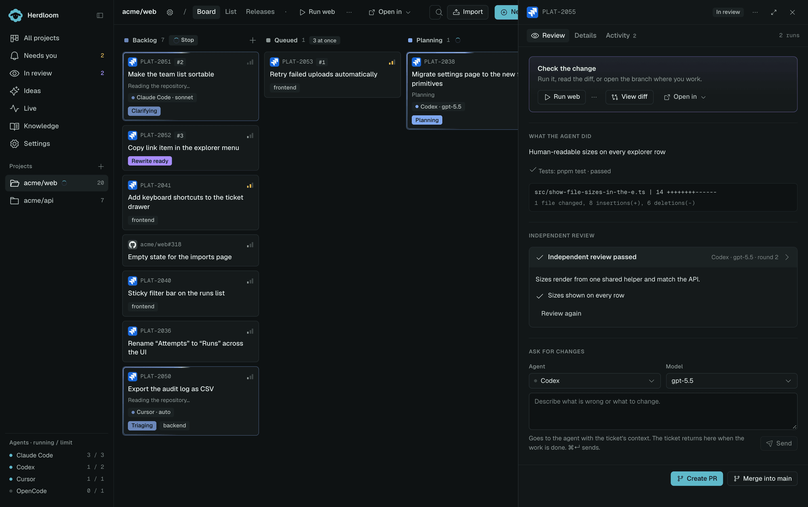
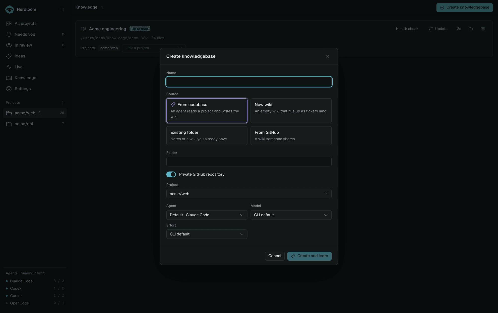
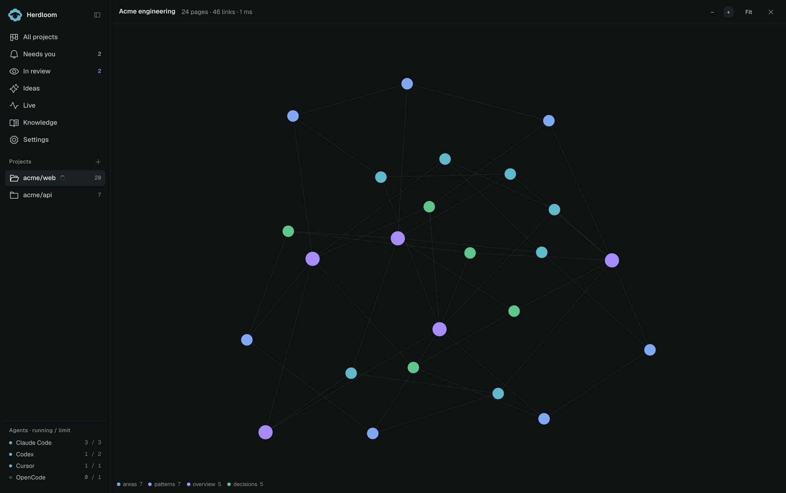
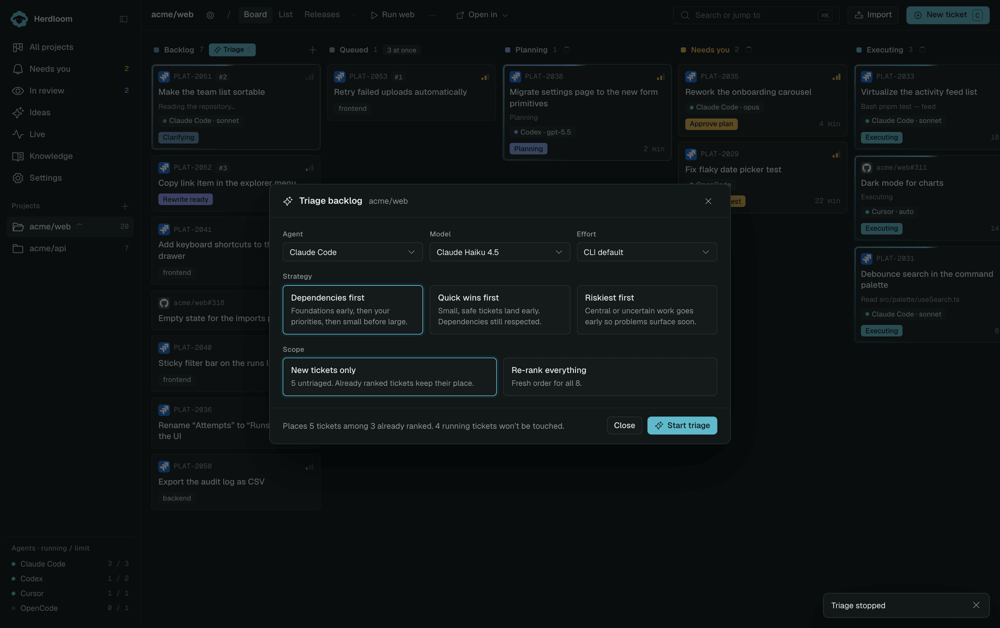
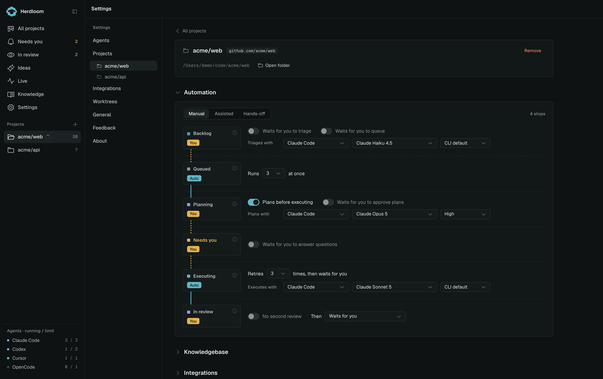
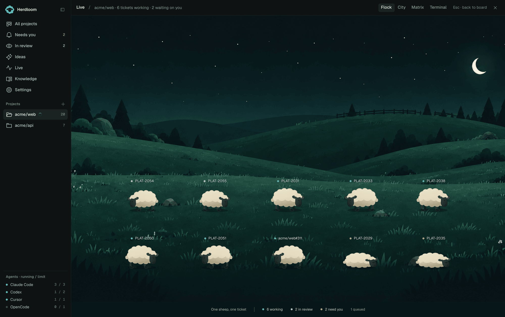

# Herdloom

**A kanban board for coding agents.**

Write a ticket. An agent picks it up, works in its own branch, and hands the change back for review.

---

## Start with an idea, not a backlog

You do not have to know the tickets before you begin. Describe the outcome you want, and the agent reads the repository, asks what it needs to know, and proposes a set of tickets — each with acceptance criteria, a size, a concept sketch, and what it depends on.

Ask for a smaller first version, change the scope, or add what it missed. Nothing reaches the board until you accept.

When you do, the tickets land in the backlog with their dependencies and everything you attached. Work that needs a foundation waits for that foundation to merge before it starts.

Keep talking to the same conversation later and it adds to what you already accepted, rather than starting again.

---

## Plan, execute, review

A stronger model plans. A cheaper one builds. A third one reviews before you see anything.

Every ticket gets its own git worktree and its own branch, so agents never edit the same files at the same time, and nothing lands on your main checkout until you say so.

---

## It remembers

Point Herdloom at a wiki or a folder of notes. Every ticket reads it before planning, and every landed ticket is written back into it.

The pages link to each other, so the picture gets better the more you ship. Herdloom checks the wiki against itself and fixes what it can.

Start it from a repository and Herdloom reads the code and writes the first pages itself. Ideas reads it too, so proposals follow the conventions you already have.

---

## It triages and clarifies

Drop rough ideas in. Herdloom ranks and sizes them, spots what blocks what, and rewrites the vague ones into something an agent can actually build.

Label an issue in Jira or GitHub and it lands on the board on its own.

---

## Assisted, or hands-off for the brave

Every column has a switch: wait for you, or run on its own. Start assisted and approve what matters. Let go when the agents have earned it.

---

## Your agents, your subscriptions

Herdloom drives the coding agent CLIs you already have, using your own accounts and your own subscriptions. Run one, or all of them at the same time, on the same board.

No hidden costs. Nothing runs through an account of ours.

---

## See the rest of it

[Every screen, in one page](docs/screenshots.md) — the board and the ticket drawer, Ideas, planning and approvals, triage, review and releases, knowledgebases, the live views, automation column by column, every settings page, and first launch.

---

## Requirements

- macOS on Apple Silicon
- git, and a local checkout of whatever you want worked on
- At least one coding agent CLI, signed in with your own account:
  Claude Code, Codex, Cursor, GitHub Copilot, OpenCode or Antigravity

## Status

Herdloom is in private beta. There is no public download yet.

Want in? [Open a discussion](../../discussions) and say what you would use it for.

## Feedback and problems

- Something broken: [open an issue](../../issues/new/choose)
- An idea, a question, or a workflow you want: [start a discussion](../../discussions)

Please include the app version and which agent CLI you were using. Screenshots help.

## Security and privacy

Herdloom runs on your machine and works on your code. It does not send your source anywhere, and there is no telemetry.

- [Security policy](SECURITY.md) — how to report a vulnerability
- [Privacy](PRIVACY.md) — what the app touches and what leaves your machine

## Licence

Herdloom is proprietary software. See [LICENSE](LICENSE).

This repository holds the public documentation, the issue tracker and the discussions. The source is not published.

© 2026 Julian Oczkowski. Herdloom and the Herdloom mark are trademarks of Julian Oczkowski.

